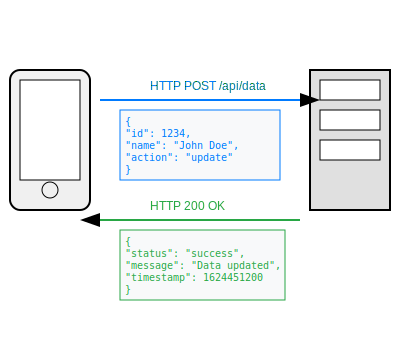
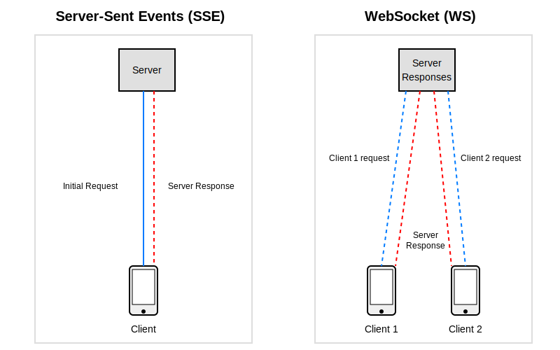

# Real-Time Communication in Android: HTTP, WebSockets, and SSE

This project is specifically developed for the Droidcon Berlin 2024 presentation. It showcases a Kotlin Multiplatform approach to building applications that can run on Android and server-side platforms using shared code and modern development practices.

## Project Structure

- **`/composeApp`**: Contains the Android-specific implementation using Jetpack Compose.
  - **`commonMain`**: Code that is shared across all platforms.
  - **`androidMain`**: Android-specific code including UI components and platform-specific logic.

- **`/server`**: Contains the server-side application built with Ktor.
  - **`src/main/kotlin`**: Contains Kotlin code for server-side logic.
    - **`Application.kt`**: Main entry point for the Ktor application.
    - **`RoutingRest.kt`**: Defines RESTful API endpoints.
    - **`RoutingSSE.kt`**: Defines Server-Sent Events (SSE) endpoints.
    - **`RoutingWS.kt`**: Defines WebSocket endpoints.

- **`/shared`**: Contains code that is shared between the Android and server components.
  - **`commonMain`**: Core business logic, data models, and shared utilities.
  - **`data/repository`**: Data repository implementations.
  - **`data/source`**: Data source interfaces and implementations.
  - **`ui`**: Shared UI components and view models.

## Purpose and Features

### Purpose

The primary goal of this project is to demonstrate the capabilities of Kotlin Multiplatform in building robust and scalable applications that can run seamlessly on both Android and server-side environments. This project will be used as a case study in the dcbln24 presentation to highlight the following:

- Code sharing across platforms
- Using Ktor for server-side development
- Implementing real-time features with SSE and WebSockets
- Utilizing Jetpack Compose for modern Android UI development

### Features

1. **Traditional Communication**:
  - **HTTP**: Standard request-response communication pattern.


2. **Real-Time Communication**:
- **WebSockets**: Enables bidirectional communication between the server and client.
- **Server-Sent Events (SSE)**: Allows the server to push updates to the client in real-time.


## Getting Started

### Building the Project

1. **Clone the repository**:
    ```bash
    git clone https://github.com/mbakgun/dcbln24-mbakgun.git
    cd dcbln24-mbakgun
    ```

2. **Build the server**:
    ```bash
    cd server
    ./gradlew build
    ```

3. **Run the server**:
    ```bash
    ./gradlew run
    ```

4. **Build the Android application**:
    ```bash
    cd composeApp
    ./gradlew build
    ```

5. **Run the Android application**:
   Open the project in Android Studio and run the application on an emulator or physical device.

## Learn More

For more information about Kotlin Multiplatform, visit the [official documentation](https://www.jetbrains.com/help/kotlin-multiplatform-dev/get-started.html).
